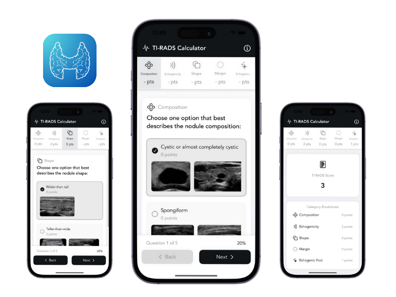

# TI-RADS Calculator

A modern, mobile-friendly web and mobile application for calculating Thyroid Imaging Reporting and Data System (TI-RADS) scores based on ultrasound characteristics of thyroid nodules.

## Features

- **Interactive Questionnaire**: Answer questions about thyroid nodule characteristics with visual examples
- **Multiple Selection Support**: Select multiple options for Echogenic Foci when applicable
- **Visual Examples**: Each option includes multiple ultrasound images for better understanding
- **Instant Scoring**: Automatic calculation of TI-RADS score based on selections
- **Detailed Recommendations**: Get follow-up and FNA recommendations based on the score
- **Mobile-Friendly**: Responsive design that works well on all devices
- **No Installation Required**: Works directly in the web browser
- **iPhone App Available**: Download our iOS app for an enhanced experience

## How to Use

1. Select the most appropriate option for each characteristic:
   - Composition
   - Echogenicity
   - Shape
   - Margin
   - Echogenic Foci (multiple selections allowed)

2. Click "Calculate TI-RADS Score" when all selections are made

3. Review the results:
   - TI-RADS Score (0-10)
   - Risk Category (TR1-TR5)
   - Score Breakdown
   - Follow-up Recommendations

## TI-RADS Categories

- **TR1 (0-1 points)**: Benign
- **TR2 (2 points)**: Not Suspicious
- **TR3 (3-4 points)**: Mildly Suspicious
- **TR4 (5-6 points)**: Moderately Suspicious
- **TR5 (≥7 points)**: Highly Suspicious

## Recommendations

Based on the 2017 ACR TI-RADS guidelines:

- **TR1**: No FNA needed. Follow-up ultrasound in 2 years.
- **TR2**: No FNA needed. Follow-up ultrasound in 2-3 years.
- **TR3**: Consider FNA if nodule ≥ 2.5 cm. Follow-up ultrasound in 1-2 years.
- **TR4**: FNA recommended if nodule ≥ 1.5 cm. Follow-up ultrasound in 1 year.
- **TR5**: FNA recommended if nodule ≥ 1 cm. Consider surgical consultation.

## Technical Details

- Built with HTML, CSS (Tailwind), and JavaScript
- No backend required - works entirely in the browser
- Responsive design using Tailwind CSS
- Mobile-first approach
- Local storage for banner preferences

## iPhone App

For an enhanced experience, download our iPhone app:

## Disclaimer

This calculator is based on the 2017 ACR TI-RADS guidelines. Clinical judgment should always be used in conjunction with these recommendations. This tool is intended for educational purposes and should not replace professional medical advice.